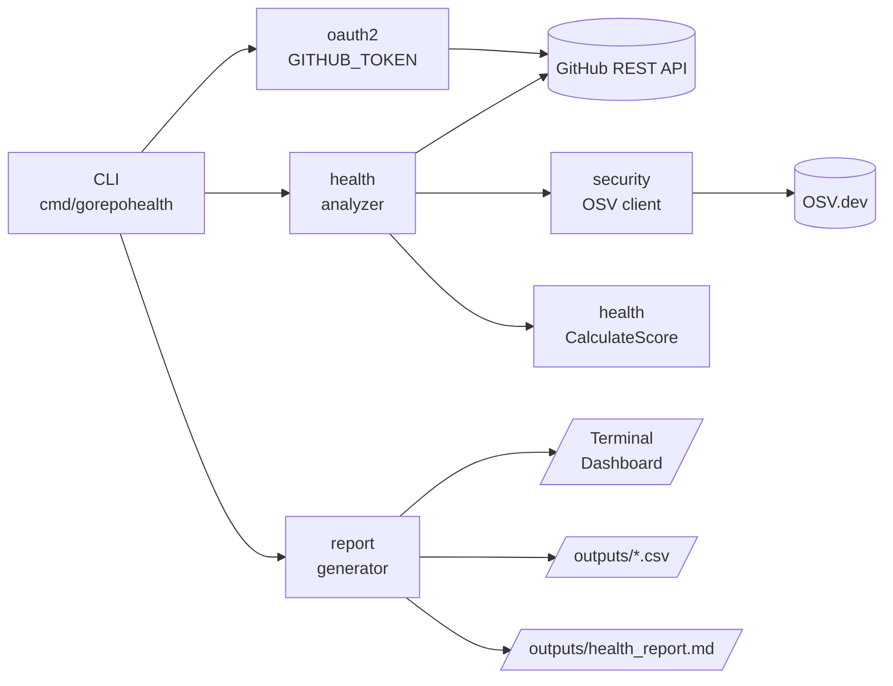

<div align="center">
  <h1>GoRepoHealth</h1>
  <p>Health auditor and scoring engine for GitHub repositories — code, CI, and dependency vulnerabilities in one report.</p>

  

  <br>


[](https://goreportcard.com/report/github.com/esousa97/gorepohealth)
[](https://www.codefactor.io/repository/github/esousa97/gorepohealth)
[](https://pkg.go.dev/github.com/esousa97/gorepohealth)


</div>

---

**GoRepoHealth** is a lightweight CLI that audits the health of a GitHub repository — or every public repository owned by a user — and produces a weighted 0–100 score. It checks for documentation (`README`, `LICENSE`), CI/CD presence (GitHub Actions), automated testing signals, and known vulnerabilities in Go module dependencies (via [OSV.dev](https://osv.dev/)). Results are rendered as a terminal dashboard, exported to CSV, and detailed in a per-repo Markdown report.

## Table of Contents

- [Overview](#overview)
- [Features](#features)
- [Tech Stack](#tech-stack)
- [Prerequisites](#prerequisites)
- [Installation](#installation)
- [Quick Start](#quick-start)
- [Configuration](#configuration)
- [Usage Guide](#usage-guide)
- [Testing](#testing)
- [Architecture](#architecture)
- [Health Scoring](#health-scoring)
- [Checks Performed](#checks-performed)
- [Output Formats](#output-formats)
- [Examples](#examples)
- [Roadmap](#roadmap)
- [Contributing](#contributing)

## Overview

When you point GoRepoHealth at a target, it walks every selected repository, runs five independent checks against the GitHub REST API and OSV.dev, calculates a weighted score, and prints a comparative dashboard:

```text
$ ./dist/gorepohealth.exe ESousa97 --export=resultado.csv
Fetching public repositories for user: ESousa97...
Analyzing ESousa97/gorepohealth...
Analyzing ESousa97/gosecretsrotator...
Analyzing ESousa97/godriftdetector...

--- Health Dashboard ---
┌─────────────────────┬────────┬─────────┬─────┬───────┬──────────┬───────┐
│ Repository          │ Readme │ License │ CI  │ Tests │ Security │ Score │
├─────────────────────┼────────┼─────────┼─────┼───────┼──────────┼───────┤
│ gorepohealth        │ YES    │ NO      │ YES │ YES   │ OK       │ 90    │
│ gosecretsrotator    │ YES    │ YES     │ YES │ YES   │ OK       │ 100   │
│ godriftdetector     │ YES    │ YES     │ YES │ YES   │ VULN     │ 50    │
└─────────────────────┴────────┴─────────┴─────┴───────┴──────────┴───────┘

Portfolio Health Average: 80.00/100
Results exported to outputs/resultado.csv
```

If a single repository is targeted, a detailed Markdown report is also written to `outputs/health_report.md` containing per-criterion breakdown and concrete suggestions for improvement.

## Features

| Feature | Description |
|---------|-------------|
| 📄 **Documentation Audit** | Verifies presence of `README` (`GetReadme` endpoint) and `LICENSE` (`License` endpoint) |
| ⚙️ **CI Detection** | Lists `.github/workflows/*.yml` and inspects content for test invocations |
| 🧪 **Test-Signal Heuristic** | Scans workflow YAML for `test` keywords (`go test`, `npm test`, etc.) |
| 🛡️ **Vulnerability Scanning** | Parses `go.mod` and queries [OSV.dev](https://osv.dev/) for each direct dependency |
| 🎯 **Weighted Scoring** | 0–100 score across 5 criteria (Security weighted at 50%) |
| 📊 **Terminal Dashboard** | Color-aware comparative table powered by `olekukonko/tablewriter` |
| 📁 **CSV Export** | `--export` flag emits a flat CSV under `outputs/` for spreadsheets and BI tools |
| 📝 **Markdown Reports** | Detailed `health_report.md` with per-check breakdown and remediation suggestions |
| 👥 **Multi-Repo Mode** | Pass `<owner>` instead of `<owner/repo>` to audit every public repo of a user |
| 🔐 **OAuth2 Authentication** | Uses a GitHub PAT via `GITHUB_TOKEN` for higher rate limits and private-repo access |

## Tech Stack

| Technology | Purpose |
|---|---|
| **Go 1.26** | Single static binary, strong stdlib, ideal for CLI workloads |
| **google/go-github/v62** | Official GitHub REST API client (`Repositories.GetReadme`, `License`, `GetContents`, `List`) |
| **golang.org/x/oauth2** | Static token source for `GITHUB_TOKEN`-based authentication |
| **golang.org/x/mod/modfile** | Authoritative `go.mod` parser used to enumerate direct dependencies |
| **olekukonko/tablewriter** | Terminal table renderer for the comparative dashboard |
| **OSV.dev REST API** | Open Source Vulnerabilities database — queried per dependency for known CVEs |
| **encoding/csv** | Stdlib CSV writer for spreadsheet-friendly export |
| **GitHub Actions** | CI pipeline: tests + cross-platform build matrix (linux/windows/darwin amd64) |
| **Dependabot** | Weekly automated updates for Go modules and GitHub Actions |

## Prerequisites

- **Go** >= 1.26.0 (for build-from-source)
- **GitHub Personal Access Token** with `public_repo` scope (or `repo` for private repositories)
- *(Optional)* Network access to `api.github.com` and `api.osv.dev`

## Installation

### From Source

```bash
git clone https://github.com/esousa97/gorepohealth.git
cd gorepohealth

go mod download
go build -o dist/gorepohealth ./cmd/gorepohealth/main.go

./dist/gorepohealth --help
```

### Via `go install`

```bash
go install github.com/esousa97/gorepohealth/cmd/gorepohealth@latest
gorepohealth --help
```

### Cross-Platform Build

```bash
mkdir -p bin
GOOS=linux   GOARCH=amd64 go build -o bin/gorepohealth-linux-amd64        ./cmd/gorepohealth/main.go
GOOS=windows GOARCH=amd64 go build -o bin/gorepohealth-windows-amd64.exe  ./cmd/gorepohealth/main.go
GOOS=darwin  GOARCH=amd64 go build -o bin/gorepohealth-darwin-amd64       ./cmd/gorepohealth/main.go
```

### GitHub Token

Every command needs a Personal Access Token to authenticate with the GitHub REST API. Export it once per shell:

**Linux/macOS (bash/zsh):**

```bash
export GITHUB_TOKEN='ghp_your_token_here'
```

**Windows (PowerShell):**

```powershell
$env:GITHUB_TOKEN = 'ghp_your_token_here'
```

> Without a token the GitHub API enforces a 60 req/h unauthenticated rate limit — multi-repo analysis will exhaust this in seconds. Generate a fine-scoped token at https://github.com/settings/tokens.

## Quick Start

### 1. Audit a Single Repository

```bash
export GITHUB_TOKEN='ghp_...'

./dist/gorepohealth google/go-github
```

A terminal dashboard is printed, and a detailed Markdown report is written to `outputs/health_report.md`.

### 2. Audit Every Public Repository of a User

```bash
./dist/gorepohealth ESousa97
```

The dashboard now shows one row per repository, plus a portfolio-wide average score at the bottom.

### 3. Export to CSV

```bash
./dist/gorepohealth ESousa97 --export=resultado.csv
# Results exported to outputs/resultado.csv
```

The CSV is emitted under `outputs/` unless an absolute or relative path with separators is provided.

### 4. Local Smoke Test

```bash
# Windows
./scripts/test.bat
```

The script runs unit tests, builds the binary, and (if `GITHUB_TOKEN` is set) drives an end-to-end audit against `google/go-github`.

## Configuration

### Environment Variables

| Variable | Type | Default | Description |
|---|---|---|---|
| `GITHUB_TOKEN` | String | — *(required)* | GitHub Personal Access Token used as the OAuth2 bearer for every API call |

### Command-Line Flags

```text
Usage: gorepohealth [options] <owner/repo> or <owner>

Flags:
  --export string   Export results to CSV (e.g., --export=results.csv)
```

| Flag | Type | Default | Purpose |
|---|---|---|---|
| `--export` | String | `""` | When set, writes a flat CSV with one row per repository. Bare filenames are placed under `outputs/`; paths containing `/` or `\` are honored as-is |

### Target Argument

| Argument shape | Behavior |
|---|---|
| `<owner>/<repo>` | Single-repository audit. Generates a Markdown report under `outputs/health_report.md` |
| `<owner>` | Multi-repository audit. Lists all *public* repos of the user via `Repositories.List` and audits each one |

## Usage Guide

### 1. Single-Repository Audit

```bash
./dist/gorepohealth google/go-github
```

Output sequence:

1. `Analyzing google/go-github...`
2. Five checks run in order: README → LICENSE → CI workflows → test signals → `go.mod` + OSV.dev queries.
3. The dashboard table is printed to stdout.
4. `outputs/health_report.md` is written with the breakdown and remediation suggestions.

### 2. Multi-Repository Audit

```bash
./dist/gorepohealth ESousa97
```

The CLI calls `Repositories.List` with `Type: "public"` and `PerPage: 100`. Each repository is analyzed sequentially; failures on one repo do not abort the run (an error is logged and the next repo proceeds). When more than one result is collected, a portfolio average is appended:

```text
Portfolio Health Average: 87.32/100
```

### 3. CSV Export

```bash
./dist/gorepohealth ESousa97 --export=audit-2026-04.csv
```

The resulting CSV columns: `Repository, Readme, License, CI, Tests, Security_Vulns, Score`. `Security_Vulns` is the *count* of distinct OSV IDs across all direct dependencies — `0` is the healthy state.

### 4. Reading the Markdown Report

After a single-repo audit:

```bash
cat outputs/health_report.md
```

The report contains:
- **Overall Score** (0–100)
- **Analysis Breakdown** — boolean per criterion
- **Suggestions** — one line per missing item (e.g. `- Add a LICENSE`, `- Configure CI`, `- Fix Vulnerabilities`)

### 5. Inspecting Vulnerabilities

The vulnerability check posts each direct dependency to OSV.dev:

```text
POST https://api.osv.dev/v1/query
{
  "version": "v1.2.3",
  "package": { "name": "github.com/foo/bar", "ecosystem": "Go" }
}
```

The IDs returned (e.g. `GO-2024-1234`, `GHSA-xxxx`) are aggregated into the `Vulnerabilities` slice for that repository. Indirect dependencies are intentionally skipped to keep noise low.

## Testing

### Unit Tests

```bash
# All packages
go test ./...

# With coverage
go test -cover ./...

# Verbose
go test -v ./...
```

The unit suite currently covers `health.CalculateScore` with three table-driven cases: perfect score, missing-everything, and docs-only ([pkg/health/analyzer_test.go](pkg/health/analyzer_test.go)).

### Race Detector (CI parity)

```bash
go test -race -count=1 ./...
```

### Build Verification

```bash
go build -o /dev/null ./cmd/gorepohealth/main.go
```

### Integration Smoke Test

The repo ships [scripts/test.bat](scripts/test.bat), which runs unit tests, performs a build check, and (when `GITHUB_TOKEN` is exported) drives a real audit against `google/go-github`:

```powershell
./scripts/test.bat
```

## Architecture

GoRepoHealth is layered to keep the GitHub API client, the analysis logic, and the report generators isolated:



### Package Structure

```text
gorepohealth/
├── cmd/
│   └── gorepohealth/
│       └── main.go              # Entry point — flag parsing, OAuth2 client, orchestration
├── pkg/
│   ├── health/
│   │   ├── analyzer.go          # CheckRepoHealth + RepoHealth + CalculateScore
│   │   └── analyzer_test.go     # Table-driven unit tests for scoring
│   ├── security/
│   │   └── osv.go               # OSV.dev REST client (POST /v1/query)
│   └── report/
│       └── generator.go         # DisplayDashboard, ExportToCSV, GenerateMarkdown
├── scripts/
│   └── test.bat                 # Local test runner (unit + build + integration)
├── .github/
│   ├── workflows/ci.yml         # Test + cross-platform build matrix
│   └── dependabot.yml           # Weekly updates for gomod + github-actions
├── outputs/                     # Generated CSV and Markdown reports
├── dist/                        # Local build artifacts
├── go.mod / go.sum
└── README.md
```

### Design Patterns

- **Pipeline** — `main` builds an authenticated client once, fans out a list of `<owner/repo>` strings, and feeds each through `CheckRepoHealth → CalculateScore → DisplayDashboard`.
- **Strategy** — `report.GenerateMarkdown`, `report.ExportToCSV`, and `report.DisplayDashboard` are interchangeable sinks over the same `[]health.RepoHealth` slice.
- **Aggregation** — `RepoHealth.Suggestions` is built lazily inside `CalculateScore` so the report layer never re-derives missing-item logic.
- **Tolerant orchestration** — a per-repo error in multi-repo mode is logged and skipped, never aborting the whole run.

A deeper walkthrough lives in [docs/ARCHITECTURE.md](docs/ARCHITECTURE.md).

## Health Scoring

The total score is the sum of five weighted criteria (max **100**):

| Criterion | Weight | Earned When |
|---|---:|---|
| **README** | 10 | `Repositories.GetReadme` returns no error |
| **LICENSE** | 10 | `Repositories.License` returns no error |
| **CI (GitHub Actions)** | 15 | `.github/workflows` exists and contains at least one entry |
| **Automated Tests** | 15 | Any workflow YAML contains the substring `test` |
| **Security (no vulns)** | 50 | `len(Vulnerabilities) == 0` after OSV.dev queries |
| **Total** | **100** | |

Security is intentionally weighted highest: a project with perfect docs and a known RCE in a dependency is not healthy. The "no vulnerabilities" branch is binary — any CVE on any direct dependency drops the 50-point block to zero and adds `Fix Vulnerabilities` to the suggestions list.

## Checks Performed

### 1. README Check

```go
_, _, err := client.Repositories.GetReadme(ctx, owner, repo, nil)
```

Uses the dedicated GitHub endpoint, which is content-aware (it accepts any of `README`, `README.md`, `README.rst`, etc.).

### 2. LICENSE Check

```go
_, _, err = client.Repositories.License(ctx, owner, repo)
```

GitHub auto-detects licenses based on file content — relying on this endpoint is more accurate than a filename match.

### 3. CI Detection

```go
_, dirContent, _, err := client.Repositories.GetContents(ctx, owner, repo, ".github/workflows", nil)
```

A non-empty directory listing is sufficient. The check is intentionally lenient — any workflow counts as "CI present."

### 4. Test-Signal Heuristic

For each `*.yml` / `*.yaml` under `.github/workflows`, the file is fetched and scanned for the substring `test`. This heuristic catches `go test`, `npm test`, `pytest`, `cargo test`, `pnpm run test`, etc. False positives are accepted as the cost of language-agnosticism.

### 5. Vulnerability Scan

`go.mod` is fetched and parsed via `golang.org/x/mod/modfile`. Each direct dependency (indirects are skipped) is sent to OSV.dev:

```go
POST https://api.osv.dev/v1/query
{ "version": "...", "package": { "name": "...", "ecosystem": "Go" } }
```

Returned IDs (`GO-YYYY-NNNN`, `GHSA-*`) are appended to `RepoHealth.Vulnerabilities` with package + version metadata.

> Non-Go repositories pass this check trivially (no `go.mod` → no scan → 50/50). Multi-ecosystem support is on the [Roadmap](#roadmap).

## Output Formats

### Terminal Dashboard

Rendered with `olekukonko/tablewriter`:

```text
--- Health Dashboard ---
┌────────────────┬────────┬─────────┬─────┬───────┬──────────┬───────┐
│ Repository     │ Readme │ License │ CI  │ Tests │ Security │ Score │
├────────────────┼────────┼─────────┼─────┼───────┼──────────┼───────┤
│ go-github      │ YES    │ YES     │ YES │ YES   │ OK       │ 100   │
└────────────────┴────────┴─────────┴─────┴───────┴──────────┴───────┘
```

### CSV Export (`outputs/*.csv`)

Flat columns suitable for spreadsheets and BI:

```csv
Repository,Readme,License,CI,Tests,Security_Vulns,Score
go-github,true,true,true,true,0,100
gorepohealth,true,false,true,true,0,90
godriftdetector,true,true,true,true,4,50
```

### Markdown Report (`outputs/health_report.md`)

Generated only for single-repo audits:

```markdown
# Health Report: google/go-github

## Overall Score: **100/100**

### Analysis Breakdown
- **README:** true
- **LICENSE:** true
- **CI (GitHub Actions):** true
- **Automated Tests:** true
- **Security (Vulnerabilities):** true
```

## Examples

### Example 1: Audit a Single Open-Source Project

```bash
export GITHUB_TOKEN='ghp_...'

./dist/gorepohealth google/go-github
# Analyzing google/go-github...
# --- Health Dashboard ---  (single-row table)
# Detailed report generated: outputs/health_report.md

cat outputs/health_report.md
```

### Example 2: Portfolio Audit + CSV

```bash
./dist/gorepohealth ESousa97 --export=portfolio.csv
# Fetching public repositories for user: ESousa97...
# Analyzing ESousa97/gorepohealth...
# Analyzing ESousa97/gosecretsrotator...
# ...
# Portfolio Health Average: 87.32/100
# Results exported to outputs/portfolio.csv
```

Open `outputs/portfolio.csv` in Excel / Google Sheets for sorting and pivot tables.

### Example 3: CI Gate (Fail on Score Drop)

Use GoRepoHealth as a quality gate inside a pipeline:

```bash
#!/usr/bin/env bash
set -euo pipefail

./dist/gorepohealth myorg/myrepo --export=score.csv
SCORE=$(awk -F',' 'NR==2 {print $7}' outputs/score.csv)

if (( SCORE < 80 )); then
  echo "::error::Health score $SCORE is below the 80 threshold"
  exit 1
fi
echo "Health score: $SCORE/100"
```

### Example 4: Comparative Org Audit

```bash
for owner in google kubernetes hashicorp; do
  ./dist/gorepohealth "$owner" --export="audit-${owner}.csv"
done

# Each CSV lands under outputs/ — load all three into a single dataframe
# to compare median scores, vulnerability density, and CI adoption.
```

## Roadmap

The project was built in five stages — all delivered.

### Stage 1 — Metadata Scanner (GitHub API)

- [x] CLI scaffold in Go using the official `google/go-github/v62` client
- [x] Authentication via Personal Access Token (`GITHUB_TOKEN` environment variable)
- [x] `<owner>/<repo>` argument parsing for single-repository targeting
- [x] `README` detection via `Repositories.GetReadme` (content-aware endpoint)
- [x] `LICENSE` detection via `Repositories.License` (content-based auto-detection)
- [x] Plain-text terminal summary of findings

### Stage 2 — CI/CD Audit (Workflow Inspector)

- [x] `.github/workflows` directory enumeration via `Repositories.GetContents`
- [x] YAML workflow file discovery (`*.yml` / `*.yaml`)
- [x] Test-signal heuristic — scans workflow content for `test` invocations (`go test`, `npm test`, `pytest`, etc.)
- [x] Boolean flags `HasCI` and `HasAutoTest` exposed in the audit struct
- [x] Project's own CI pipeline cross-building for linux/windows/darwin amd64

### Stage 3 — Security & Dependencies (Vulnerability Scan)

- [x] `go.mod` retrieval and parsing via `golang.org/x/mod/modfile`
- [x] OSV.dev `/v1/query` integration for the Go ecosystem
- [x] Per-dependency vulnerability lookup with package + version + advisory ID
- [x] Indirect-dependency exclusion to keep findings actionable
- [x] Highlighted `VULN` flag in the dashboard for any affected repository

### Stage 4 — Scoring Engine (The Health Logic)

- [x] Weighted 0–100 score formula: `S = Σ (wᵢ · cᵢ)`
- [x] Per-criterion weights: README (10), LICENSE (10), CI (15), Tests (15), No Vulnerabilities (50)
- [x] Per-criterion remediation suggestions appended automatically when a check fails
- [x] Markdown report (`outputs/health_report.md`) with score, breakdown, and suggestions
- [x] Idempotent re-scoring (`CalculateScore` resets state on each call)

### Stage 5 — Dashboard & Automation (Batch Analysis)

- [x] Multi-repo mode — pass `<owner>` to enumerate every public repository (`Repositories.List`, `PerPage: 100`)
- [x] Comparative terminal dashboard powered by `olekukonko/tablewriter`
- [x] Portfolio-wide average score for multi-repo runs
- [x] `--export=<file>.csv` flag for spreadsheet/BI consumption
- [x] Auto-creation of the `outputs/` directory for all generated artifacts
- [x] Tolerant orchestration — per-repo errors are logged and skipped, never aborting the batch

## Contributing

See [CONTRIBUTING.md](./CONTRIBUTING.md) for instructions on running tests, linting, and opening pull requests.

## License

[MIT License](./LICENSE)

<div align="center">

## Author

**Enoque Sousa**

[](https://www.linkedin.com/in/enoque-sousa-bb89aa168/)
[](https://github.com/esousa97)
[](https://enoquesousa.vercel.app)

**[⬆ Back to Top](#gorepohealth)**

Made with ❤️ by [Enoque Sousa](https://github.com/esousa97)

**Project Status:** Study project — feature-complete for GitHub + Go-ecosystem audits

</div>
