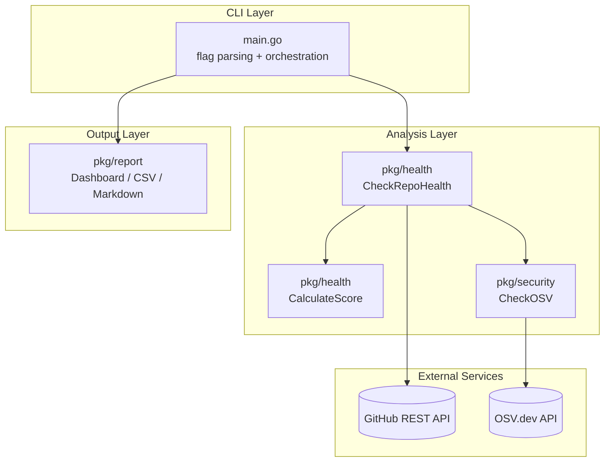

# Architecture

This document describes the internal layering of GoRepoHealth, the data flow of a single audit, and the rationale behind the package boundaries.

## Table of Contents

- [High-Level View](#high-level-view)
- [Data Flow](#data-flow)
- [Package Responsibilities](#package-responsibilities)
- [Core Types](#core-types)
- [Scoring Algorithm](#scoring-algorithm)
- [Error Handling Strategy](#error-handling-strategy)
- [GitHub API Surface](#github-api-surface)
- [OSV.dev Integration](#osvdev-integration)
- [Output Generation](#output-generation)
- [Testing Strategy](#testing-strategy)
- [Performance Characteristics](#performance-characteristics)
- [Extension Points](#extension-points)

## High-Level View

GoRepoHealth is a four-layer pipeline:



The dependency graph is strictly downward: `cmd → pkg/health → pkg/security`, and `cmd → pkg/report → pkg/health` (read-only). No package imports `cmd`, and `pkg/report` never talks to GitHub.

## Data Flow

A single audit follows this sequence:

1. **Bootstrap** (`cmd/gorepohealth/main.go`)
   - Parse `--export` flag and positional argument.
   - Read `GITHUB_TOKEN` from environment.
   - Build an `oauth2.StaticTokenSource` and wrap it in a `github.Client`.

2. **Target resolution**
   - If the argument contains `/`, treat it as `owner/repo` — single-repo mode.
   - Otherwise, list all public repos for the owner via `Repositories.List` (paginated, `PerPage: 100`).

3. **Per-repo analysis** (`pkg/health.CheckRepoHealth`)
   - Five independent checks against the GitHub API.
   - For Go repos, dependency scanning escalates to OSV.dev (`pkg/security.CheckOSV`).
   - Returns a populated `*RepoHealth`.

4. **Scoring** (`pkg/health.RepoHealth.CalculateScore`)
   - Mutates the struct: sets `Score` and appends to `Suggestions`.

5. **Rendering** (`pkg/report`)
   - `DisplayDashboard` always runs.
   - `ExportToCSV` runs when `--export` is set.
   - `GenerateMarkdown` runs only when exactly one repository was audited.

## Package Responsibilities

### `cmd/gorepohealth`

Single file, single responsibility: wire flags, env vars, and the GitHub client; iterate over the repository list; delegate everything else.

> **Why no Cobra?** The CLI surface is one positional argument and one flag. Adding a command framework would be net negative.

### `pkg/health`

Owns the `RepoHealth` struct and the audit logic. It is the only package that knows what "healthy" means. Adding a new criterion requires a change here and in `CalculateScore` — no other package needs to be aware.

### `pkg/security`

Thin client over OSV.dev. Isolated so the dependency on `net/http` and OSV's request/response shapes does not leak into `pkg/health`. A future migration to GitHub Advisory Database or `govulncheck` only touches this package.

### `pkg/report`

Three sinks (`DisplayDashboard`, `ExportToCSV`, `GenerateMarkdown`) over the same `[]health.RepoHealth` slice. Each sink is independent — they can be enabled or disabled without coupling.

## Core Types

### `health.RepoHealth`

```go
type RepoHealth struct {
    Name            string
    HasReadme       bool
    HasLicense      bool
    HasCI           bool
    HasAutoTest     bool
    Vulnerabilities []security.Vulnerability
    Score           int
    Suggestions     []string
}
```

`Vulnerabilities` is a slice (not a count) so the report layer can produce per-finding detail in future formats. `Suggestions` is built by `CalculateScore` so the report layer never has to re-derive remediation logic.

### `security.Vulnerability`

```go
type Vulnerability struct {
    Package string `json:"package"`
    Version string `json:"version"`
    ID      string `json:"id"`
}
```

Carries enough context to render `package@version → ID` lines in any report format. JSON tags are present for future API or webhook output.

### `security.OSVQuery` / `OSVResult`

Mirror the OSV.dev `/v1/query` request and response shapes exactly. Anonymous nested structs are used because the API contract is shallow and stable.

## Scoring Algorithm

```go
func (h *RepoHealth) CalculateScore() {
    h.Score = 0
    h.Suggestions = []string{}

    if h.HasReadme   { h.Score += 10 } else { h.Suggestions = append(h.Suggestions, "Add a README.md") }
    if h.HasLicense  { h.Score += 10 } else { h.Suggestions = append(h.Suggestions, "Add a LICENSE") }
    if h.HasCI       { h.Score += 15 } else { h.Suggestions = append(h.Suggestions, "Configure CI") }
    if h.HasAutoTest { h.Score += 15 } else { h.Suggestions = append(h.Suggestions, "Implement Tests") }
    if len(h.Vulnerabilities) == 0 { h.Score += 50 } else { h.Suggestions = append(h.Suggestions, "Fix Vulnerabilities") }
}
```

| Criterion | Weight | Rationale |
|---|---:|---|
| README | 10 | Discoverability — minimum viable documentation |
| LICENSE | 10 | Legal clarity — required for any reuse |
| CI | 15 | Automated feedback loop on every change |
| Tests | 15 | Codified safety net |
| No vulnerabilities | 50 | A known RCE outweighs all polish |

Idempotency: `CalculateScore` resets `Score` and `Suggestions` on each call, so re-scoring a struct after a state change is safe.

## Error Handling Strategy

The audit logic uses **tolerant, opportunistic** error handling — a missing README is not an error, it is a finding. Concretely:

- `client.Repositories.GetReadme` returning an error → `HasReadme = false`. No error is propagated.
- `client.Repositories.GetContents(".github/workflows", ...)` returning a 404 → `HasCI = false`.
- `go.mod` not found → no vulnerability scan, but the rest of the audit succeeds.
- `OSV.dev` returning a non-200 → the dependency is skipped (logged), not failed.

In multi-repo mode, a per-repo failure (rate limit, transient network error) is logged to stdout and the next repo proceeds. This is intentional — partial results are more useful than aborting on a single bad repo.

## GitHub API Surface

| Endpoint | Method | Purpose |
|---|---|---|
| `GET /repos/{owner}/{repo}/readme` | `Repositories.GetReadme` | README detection |
| `GET /repos/{owner}/{repo}/license` | `Repositories.License` | License detection (auto-detected by content) |
| `GET /repos/{owner}/{repo}/contents/.github/workflows` | `Repositories.GetContents` | List CI workflow files |
| `GET /repos/{owner}/{repo}/contents/{path}` | `Repositories.GetContents` | Fetch individual workflow YAML and `go.mod` |
| `GET /users/{owner}/repos` | `Repositories.List` (`Type: "public"`) | Multi-repo enumeration |

### Rate Limit Notes

- Authenticated: 5,000 requests/hour.
- Each repository audit costs **~5–7 requests** (1 readme + 1 license + 1 listing + N workflow fetches + 1 `go.mod`).
- A 100-repo portfolio uses ~500–700 requests, well under the hourly limit.

The CLI does not currently respect `X-RateLimit-Remaining` headers — if you audit large orgs you may hit the cap. Concurrent analysis with rate-limit awareness is a [Roadmap](../README.md#roadmap) item.

## OSV.dev Integration

OSV.dev is queried per direct dependency:

```http
POST https://api.osv.dev/v1/query HTTP/1.1
Content-Type: application/json

{
  "version": "v1.2.3",
  "package": {
    "name": "github.com/foo/bar",
    "ecosystem": "Go"
  }
}
```

Response shape:

```json
{
  "vulns": [
    { "id": "GO-2024-1234", "...": "..." },
    { "id": "GHSA-xxxx-yyyy-zzzz", "...": "..." }
  ]
}
```

Only the `id` field is consumed. The API does not require authentication, but is rate-limited per IP — heavy multi-repo audits should be cached client-side in the future.

### Why direct dependencies only?

Indirect dependencies of well-known modules can balloon a single audit into hundreds of OSV calls. Direct dependencies represent deliberate adoption choices and are the actionable signal. Indirect-dependency CVEs are usually fixed by updating the direct dependency that pulls them in — covered transitively when re-auditing.

## Output Generation

### Terminal Dashboard

`olekukonko/tablewriter` is used because it auto-handles unicode width, color toggling for non-TTY environments, and ASCII fallback. The header is fixed; one row per repo; the security column shows `OK` / `VULN` (binary) rather than the count, to keep the dashboard readable at a glance.

### CSV Export

`encoding/csv` from the stdlib. The header row is `Repository,Readme,License,CI,Tests,Security_Vulns,Score`. Booleans are written as `true`/`false` (Go's `strconv.FormatBool`), the security column is a *count* of vulnerabilities — both diverge from the dashboard format because CSV is consumed by spreadsheets and dataframes, not humans.

Bare filenames are placed under `outputs/`; absolute paths or paths containing `/` or `\` are honored as-is. The `outputs/` directory is created with `os.MkdirAll` before the write attempt.

### Markdown Report

Generated only when `len(reposToAnalyze) == 1`. Format is intentionally minimal — the goal is a per-repo remediation summary, not a multi-page audit report. Suggestions are emitted as bullet points, ready to paste into a GitHub issue.

## Testing Strategy

Current coverage:

- **Pure-logic tests** ([pkg/health/analyzer_test.go](../pkg/health/analyzer_test.go)) — table-driven cases over `CalculateScore`. No GitHub or OSV dependency, so the suite is fast and deterministic.
- **Build verification** in CI — `go build` for `linux/amd64`, `windows/amd64`, `darwin/amd64`.
- **Integration smoke** ([scripts/test.bat](../scripts/test.bat)) — when `GITHUB_TOKEN` is set, runs the binary against `google/go-github`.

Not yet covered (deliberate trade-offs):

- HTTP-mocked tests for `CheckRepoHealth` — would require a fake `github.Client` or an `httptest.Server`. Worth adding before the next major API surface change.
- OSV.dev client tests — the request shape is stable enough that a single record-and-replay test would suffice.

## Performance Characteristics

| Mode | API calls | Wall-clock (typical) |
|---|---:|---|
| Single repo (no Go deps) | ~4 | < 1 s |
| Single repo (10 Go deps) | ~14 | 2–4 s |
| 100-repo portfolio | 500–700 | 1–3 min (sequential) |

The audit is currently single-threaded. The largest wins from concurrency would be in multi-repo mode — each `CheckRepoHealth` call is independent and could fan out under a worker pool, bounded by the GitHub rate limit.

## Extension Points

### Adding a new criterion

1. Add a boolean (or richer) field to `RepoHealth` in [pkg/health/analyzer.go](../pkg/health/analyzer.go).
2. Populate it in `CheckRepoHealth`.
3. Add a weighted block to `CalculateScore` and a corresponding suggestion.
4. Update the dashboard header, CSV columns, and Markdown breakdown in [pkg/report/generator.go](../pkg/report/generator.go).
5. Add a table-driven case to `analyzer_test.go`.

### Adding a new vulnerability source

1. Implement a sibling client in `pkg/security` (e.g., `ghsa.go`).
2. Have `CheckRepoHealth` invoke it alongside (or instead of) `CheckOSV`.
3. Reuse the existing `Vulnerability` struct so report formatting stays unchanged.

### Adding a new ecosystem

The OSV.dev `/v1/query` endpoint accepts other ecosystems (`npm`, `PyPI`, `crates.io`, etc.). To add Node.js support:

1. Detect `package.json` in `CheckRepoHealth`.
2. Parse direct dependencies from `dependencies` (skip `devDependencies` and version ranges that resolve to multiple versions).
3. Call `CheckOSV(name, version)` with `Ecosystem: "npm"` (the current implementation hardcodes `"Go"` — this would need to become a parameter).

### Adding a new output format

1. Add a function to `pkg/report` with the same `[]health.RepoHealth` input shape.
2. Wire a flag in `cmd/gorepohealth/main.go`.
3. Optionally write to `outputs/` for consistency with existing sinks.
